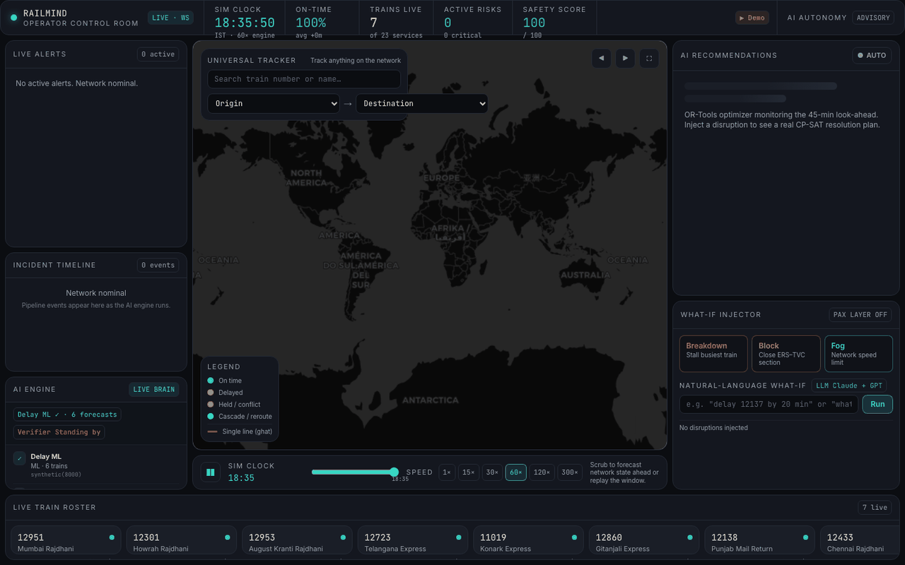
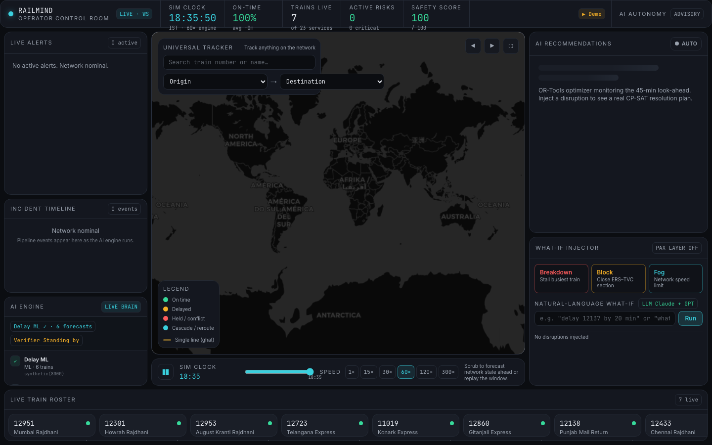
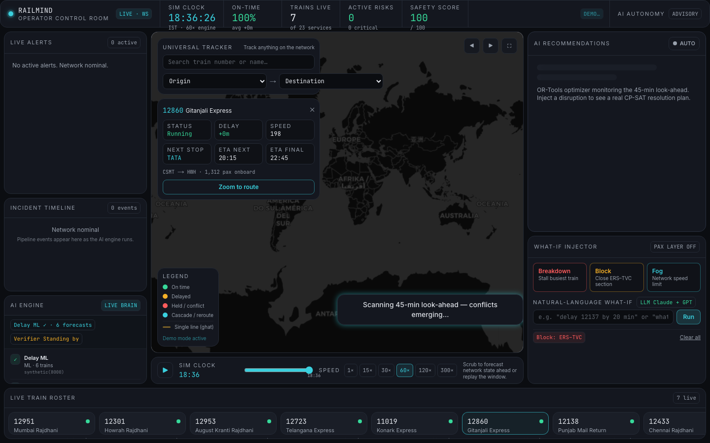
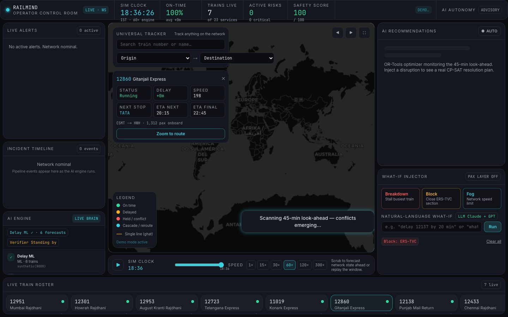

# RailMind

**Indian Railways has eyes and reflexes; RailMind gives the network a brain.**

A live digital-twin control room for railway operations — real track geometry, schedule-accurate train motion at India scale, and an eight-module AI pipeline that detects conflicts, optimizes with OR-Tools, verifies with multi-LLM consensus, and explains every decision.

<p align="center">
  
</p>

<p align="center">
  <a href="#quickstart">Quickstart</a> ·
  <a href="#architecture">Architecture</a> ·
  <a href="#real-ai-not-a-wrapper">Real AI proof</a> ·
  <a href="docs/EXTENDING.md">Extending</a> ·
  <a href="docs/SECURITY.md">Security</a>
</p>


---

## The problem

Indian Railways moves **1.3 billion passengers** a year across a dense, heterogeneous network — single-line ghats, express precedence, platform constraints, and cascading delays. Control rooms see trains on charts and alerts on radios, but not a **unified, predictive brain** that forecasts conflicts minutes ahead, proposes mathematically sound resolutions, and audits every automated decision.

## What RailMind does

RailMind is an **operator control room + digital-twin engine**:

1. **Live map** — every train moves along real route geometry (arc-length kinematics, not fake animation).
2. **45-minute look-ahead** — conflict detection on headway, platform, and congestion.
3. **AI recommendations** — OR-Tools CP-SAT plans with delay saved, passengers protected, and a **VERIFIED ✓ N/N** badge from multi-model checks.
4. **What-if + natural language** — inject breakdown / block / fog, or type *"delay 12137 by 30 min"* and watch the network react.
5. **Incident Timeline** — timestamped audit log of every pipeline event; click to scrub/replay.
6. **Demo Mode** — one-click, on-camera-safe walkthrough for judges and stakeholders.

> **Honest scope:** This MVP runs one corridor in full fidelity (**Mumbai CSMT → Igatpuri**, including the Kasara–Igatpuri ghat) plus an **India-wide** dataset for map scale. Train positions are **schedule-modeled with disruption physics** — there is no open Indian Railways live GPS feed. The architecture is built to swap in real feeds.

---

## Key features

| Feature | What you get |
|---------|----------------|
| **Live India map** | deck.gl + MapLibre, viewport culling, GPU-smooth pan/zoom/follow at full train count |
| **Universal tracker** | Search any train or origin→destination; camera fly-to + follow |
| **AI recommendations** | Per-conflict plans, Apply / Simulate, autonomous auto-apply when verified |
| **What-if + NL** | Buttons + natural-language commands with impact explanation |
| **AI Engine panel** | Live status of all 8 brain modules (latency, last action) |
| **Incident Timeline** | Conflict → forecast → optimize → verify → apply → outcome |
| **Demo Mode** | Block ghat / Breakdown flagship / Fog network — scripted, repeatable |

<p float="left">
  
  
</p>

<p align="center">
  
</p>

---

## Architecture

**One engine, two faces:** a modular Python brain streams typed snapshots over WebSocket; the Next.js control room renders them (with a local fallback sim when offline).

<p align="center">
  
</p>

### The 8 AI modules

| Module | Role | Implementation |
|--------|------|----------------|
| Delay ML | Forecast per-train delay | `backend/railmind/forecaster.py` + `train_delay.py` |
| Cascade | Downstream delay propagation | `backend/railmind/predictor_hybrid.py` |
| Conflict detector | 45-min look-ahead scan | `backend/railmind/detectors.py` |
| OR-Tools optimizer | CP-SAT resolution plans | `backend/railmind/optimizer_ortools.py` |
| Multi-LLM verifier | Safety consensus + flag | `backend/railmind/verifier_llm.py` |
| NL agent | Natural-language what-if | `backend/railmind/nl_agent.py` |
| Passenger impact | Pax / connections at risk | `backend/railmind/passenger.py` |
| Anomaly sentinel | Baseline drift signals | `backend/railmind/anomaly.py` |

Orchestration, timeline, and module telemetry: `backend/railmind/orchestrator.py`, `brain.py`, `timeline.py`.

### The hybrid moat

- **OR-Tools solves the math** — precedence, holds, and capacity as a constraint problem (`CpSatOptimizer`), with a greedy fallback if the solver times out.
- **Multi-LLM verifies + explains** — rule gate first, then up to two LLMs (`MultiModelVerifier`, `LLMExplainer`); without API keys, honest heuristic fallbacks run — never a silent fake.

Wire contract (keep in sync): `backend/railmind/models.py` ⇄ `frontend/lib/contract.ts`.

See **[docs/EXTENDING.md](docs/EXTENDING.md)** for swapping any module via YAML registries in `config.py`.

---

## Real AI — not a wrapper

This is what separates RailMind from a ChatGPT skin on a map:

| Capability | Evidence in repo |
|------------|------------------|
| **OR-Tools CP-SAT optimizer** | [`optimizer_ortools.py`](backend/railmind/optimizer_ortools.py) — registered as `cp_sat` in [`config/mumbai_csmt_igatpuri.yaml`](backend/config/mumbai_csmt_igatpuri.yaml) |
| **Trained delay forecaster** | [`train_delay.py`](backend/railmind/train_delay.py) → Gradient Boosting, **R² ≈ 0.987** on 8k samples; model at `backend/models/delay_forecaster.joblib` (auto-trained by `./dev.sh`) |
| **Multi-LLM verification** | [`verifier_llm.py`](backend/railmind/verifier_llm.py) — agree/total counts surface in UI as **VERIFIED ✓ N/N** |
| **NL agent** | [`nl_agent.py`](backend/railmind/nl_agent.py) + frontend [`nlCommand.ts`](frontend/lib/nlCommand.ts) |
| **28+ backend tests** | `backend/tests/` — twin kinematics, conflicts, orchestrator, intelligence stack |
| **Honest fallbacks** | No keys → rule verifier + greedy/heuristic paths; UI labels **LOCAL** vs **LIVE · WS** |

---

## Tech stack

| Layer | Stack |
|-------|-------|
| Engine | Python 3.11+, FastAPI, WebSocket, NetworkX, OR-Tools, scikit-learn, joblib |
| Control room | Next.js 14, React 18, TypeScript, Tailwind, Zustand, deck.gl 9, MapLibre |
| Contract | Pydantic `TwinSnapshot` ↔ TypeScript DTOs |
| Ops | Docker Compose, `./dev.sh` one-command dev |

---

## Data sources

All **real, free, reproducible** — bundled under `backend/data/` (mirrored in `frontend/data/` for offline fallback):

| Source | Use |
|--------|-----|
| [datameet/railways](https://github.com/datameet/railways) | Station coordinates, section topology (GeoJSON style) |
| [data.gov.in](https://data.gov.in) | Timetable spirit — representative public schedules |
| [Kaggle IR delay datasets](https://www.kaggle.com/datasets?search=indian+railways+delay) | Optional blend via `data/ir_delays.csv` for ML training |
| [Open-Meteo](https://open-meteo.com) | Planned for weather-aware delay features |

Default corridor config: [`backend/config/mumbai_csmt_igatpuri.yaml`](backend/config/mumbai_csmt_igatpuri.yaml).  
India-wide map scale: [`backend/config/india_wide.yaml`](backend/config/india_wide.yaml).

---

## Quickstart

### Prerequisites

- **Python 3.11+** and **Node 18+**
- Optional: `ANTHROPIC_API_KEY` / `OPENAI_API_KEY` for live multi-LLM verify (see [Security](#security))

### 1. Clone and configure

```bash
git clone https://github.com/your-org/railmind.git
cd railmind

cp backend/.env.example backend/.env          # optional LLM keys
cp frontend/.env.example frontend/.env.local  # optional Firebase analytics
```

### 2. Run (one command)

```bash
chmod +x dev.sh
./dev.sh
```

| Service | URL |
|---------|-----|
| **Control room** | http://localhost:3000 |
| **Engine API** | http://127.0.0.1:8000 |
| **WebSocket** | ws://127.0.0.1:8000/stream |
| **Health** | http://127.0.0.1:8000/health |

`dev.sh` creates the Python venv, installs deps, **trains the delay model if missing**, and starts both processes.

### 3. Manual (two terminals)

```bash
# Terminal A — engine (Mumbai corridor recommended for demo)
cd backend
python3 -m venv .venv && source .venv/bin/activate
pip install -r requirements.txt
PYTHONPATH=. python -m railmind.train_delay   # first run only
RAILMIND_CONFIG=config/mumbai_csmt_igatpuri.yaml \
  PYTHONPATH=. uvicorn railmind.app:app --reload --port 8000

# Terminal B — control room
cd frontend
npm install
NEXT_PUBLIC_BACKEND_URL=http://127.0.0.1:8000 npm run dev
```

### 4. Docker

```bash
docker compose up --build
# open http://localhost:3000
```

### 5. Launch Demo Mode

1. Open http://localhost:3000
2. Dismiss the onboarding overlay (first visit only)
3. Click **▶ Demo** in the KPI bar → choose **Block ghat**
4. Watch: map focus → flagship track → ghat block → Live Alerts → AI modules fire → verified plan → auto-Apply → KPI recovery

For a repeatable recording, use the Mumbai config (`RAILMIND_CONFIG=config/mumbai_csmt_igatpuri.yaml`).

### Environment variables

| Variable | Where | Purpose |
|----------|-------|---------|
| `RAILMIND_CONFIG` | backend | YAML corridor + module selection |
| `ANTHROPIC_API_KEY` | backend `.env` | Claude verifier / explainer |
| `OPENAI_API_KEY` | backend `.env` | GPT verifier / explainer |
| `NEXT_PUBLIC_BACKEND_URL` | frontend `.env.local` | Engine URL (default `http://127.0.0.1:8000`) |
| `NEXT_PUBLIC_FIREBASE_*` | frontend `.env.local` | Optional analytics (client keys) |

---

## Folder structure

```
RailMind/
├── backend/                 Python digital-twin engine
│   ├── railmind/            Core modules (orchestrator, twin, optimizers, ML, LLM)
│   ├── config/              Corridor YAML + module registries
│   ├── data/                GeoJSON + timetable (reproducible seed data)
│   ├── models/              delay_forecaster.joblib (generated — not committed)
│   └── tests/               pytest suite
├── frontend/                Next.js control room
│   ├── app/                 App Router pages
│   ├── components/          Map, panels, Demo Mode, Timeline
│   ├── store/               Zustand state + live/local bridge
│   └── lib/                 contract.ts, simulationEngine, dataLoader
├── docs/
│   ├── EXTENDING.md         How to swap every engine module
│   ├── SECURITY.md          Secrets policy + audit checklist
│   └── assets/              demo.gif, screenshots, architecture.svg, capture scripts
├── dev.sh                   One-command dev launcher
├── docker-compose.yml
└── LICENSE
```

---

## Tests

```bash
cd backend
source .venv/bin/activate
pytest -q                    # 28+ tests: geo, twin, conflicts, orchestrator, intelligence
```

Frontend type-check + production build:

```bash
cd frontend && npm run build
```

---

## Security

- **`backend/.env` and `frontend/.env.local` are gitignored and must never be committed.**
- No API keys were found in git history (see [docs/SECURITY.md](docs/SECURITY.md)).
- If you ever exposed a key: rotate immediately, purge history, update local env.

Firebase `NEXT_PUBLIC_*` values are **client-side web keys** (designed to be public, restricted by domain in Firebase console).

---

## Roadmap

- [ ] **Passenger app** — disruption-aware journey info for travelers
- [ ] **Live GPS subset** — ingest open/partner feeds where available; twin reconciles with schedule
- [ ] **Multi-corridor → national** — same engine, federated configs, regional control rooms
- [ ] **Weather layer** — Open-Meteo features into delay ML

---

## Team

Built by **[yuum.ai](https://yuum.ai)** for **Far Away 2026**.

---

## License

[MIT](LICENSE) — use, modify, and ship; attribution appreciated.

---

## Regenerating README assets

With backend and frontend running:

```bash
bash docs/assets/regenerate.sh
```

Produces `docs/assets/demo.gif` and PNG screenshots via Playwright.
