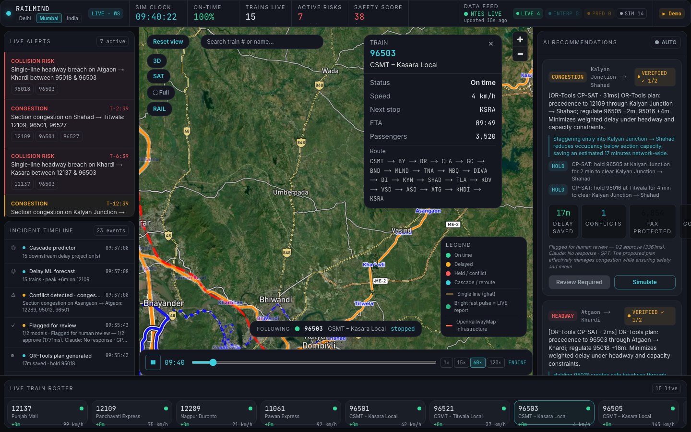

# RailMind

**Indian Railways has eyes and reflexes; RailMind gives the network a brain.**

A live digital-twin control room for railway operations — real OSM track geometry, NTES-backed running status where available, schedule-accurate motion at India scale, and an eight-module AI pipeline that detects conflicts, optimizes with OR-Tools, verifies with multi-LLM consensus, and explains every decision.

**Repository:** [github.com/Vivekmandal7/RailMind](https://github.com/Vivekmandal7/RailMind) · **Built for [Far Away 2026](https://yuum.ai)**

<p align="center">
  
</p>

<p align="center">
  <em>Real capture from the running app — satellite basemap, NTES live feed, 3D follow, and OpenRailwayMap infrastructure on the Mumbai CSMT–Igatpuri corridor.</em>
</p>

<p align="center">
  <a href="#why-railmind-wins">Why we win</a> ·
  <a href="#judge-demo-60-seconds">Judge demo</a> ·
  <a href="#quickstart">Quickstart</a> ·
  <a href="#architecture">Architecture</a> ·
  <a href="#real-ai-not-a-wrapper">Real AI proof</a> ·
  <a href="docs/EXTENDING.md">Extending</a> ·
  <a href="docs/SECURITY.md">Security</a>
</p>


---

## Why RailMind wins

| What judges look for | What RailMind delivers |
|----------------------|------------------------|
| **Real problem, India scale** | 1.3B passengers/year; cascading delays on ghats, platforms, and single-line sections |
| **Not a ChatGPT wrapper** | OR-Tools CP-SAT solver + trained delay ML (R² ≈ 0.987) + multi-LLM safety gate |
| **Live data, honest labels** | NTES running-status feed when keyed; every train tagged **LIVE** / **INTERPOLATED** / **PREDICTED** / **SIM** — no fake GPS |
| **Operator-grade UX** | Production control room: 3D follow, station deep-zoom, corridor switcher, OpenRailwayMap overlay, judge-safe Demo Mode |
| **Shippable architecture** | Modular Python engine ↔ typed WebSocket contract ↔ Next.js UI; swap any brain module via YAML |
| **Full stack** | Control room **and** passenger Flutter app (`RailMind-main/`) sharing the same network brain |

> **30-second pitch:** *Indian Railways runs on reflexes, not prediction. RailMind is a digital-twin control room that sees conflicts 45 minutes ahead, solves them with Google OR-Tools, verifies every plan with multi-model AI consensus, and shows operators exactly what's live vs simulated. One click to demo a ghat block, auto-apply a verified resolution, and watch KPIs recover — on real track geometry, with honest provenance on every train.*

---

## The problem

Indian Railways moves **1.3 billion passengers** a year across a dense, heterogeneous network — single-line ghats, express precedence, platform constraints, and cascading delays. Control rooms see trains on charts and alerts on radios, but not a **unified, predictive brain** that forecasts conflicts minutes ahead, proposes mathematically sound resolutions, and audits every automated decision.

## What RailMind does

RailMind is an **operator control room + digital-twin engine**:

1. **Live map** — trains move along real OSM-aligned route geometry (arc-length kinematics, not fake animation).
2. **Live data spine** — NTES running-status ingestion (RapidAPI) reconciled with the twin; provenance on every position.
3. **45-minute look-ahead** — conflict detection on headway, platform, and congestion.
4. **AI recommendations** — OR-Tools CP-SAT plans with delay saved, passengers protected, and a **VERIFIED ✓ N/N** badge from multi-model checks.
5. **What-if + natural language** — inject breakdown / block / fog, or type *"delay 12137 by 30 min"* and watch the network react.
6. **Incident Timeline** — timestamped audit log of every pipeline event; click to scrub/replay.
7. **Demo Mode** — one-click, on-camera-safe walkthrough for judges and stakeholders.

> **Honest scope:** Three switchable corridors (**Delhi NDLS → Agra**, **Mumbai CSMT → Igatpuri** including the Kasara ghat, **India-wide** map scale). With a RapidAPI key, trains covered by the NTES feed are tagged **LIVE**; the rest stay schedule-driven and are honestly tagged **SIM**. There is no open pan-India GPS feed — the architecture is built to ingest real feeds as they become available.

---

## Key features

| Feature | What you get |
|---------|----------------|
| **Live India map** | Mapbox GL + deck.gl, 3D train models, satellite toggle, viewport culling, GPU-smooth follow |
| **Provenance bar** | Every train labeled LIVE · INTERPOLATED · PREDICTED · SIM — transparency judges can verify |
| **Corridor switcher** | One-click **Delhi · Mumbai · India** — same engine, different YAML configs |
| **OpenRailwayMap overlay** | Real rail infrastructure layer (tracks, signals, yards) via the **RAIL** control |
| **Station deep-zoom** | Platform board with approaching, dwelling, and held trains |
| **Universal tracker** | Search any train or origin→destination; camera fly-to + follow HUD |
| **AI recommendations** | Per-conflict plans, Apply / Simulate, autonomous auto-apply when verified |
| **What-if + NL** | Buttons + natural-language commands with impact explanation |
| **AI Engine panel** | Live status of all 8 brain modules (latency, last action) |
| **Incident Timeline** | Conflict → forecast → optimize → verify → apply → outcome |
| **Demo Mode** | Block ghat / Breakdown flagship / Fog network — scripted, repeatable |
| **Passenger app** | Flutter mobile client in `RailMind-main/` — search, bookings, live map, AI assistant |

<p float="left">
  
  
</p>

<p align="center">
  
</p>

---

## Judge demo (60 seconds)

**For presentations and recording** — use the production launcher (no Next.js dev error overlay):

```bash
chmod +x demo.sh
./demo.sh
# open http://localhost:3000
```

**Script:**

1. **Corridor** — click **Mumbai** in the top bar (ghat drama) or **Delhi** (dense intercity).
2. **Provenance** — point at the provenance bar: green **LIVE** trains vs grey **SIM** (honest labeling).
3. **▶ Demo → Block ghat** — map flies to Kasara–Igatpuri, injects block, conflicts appear.
4. **AI pipeline** — watch modules fire in the Engine panel; a plan appears with **VERIFIED ✓ N/N**.
5. **Auto-apply** — KPI bar recovers; conflict flash clears green on the map.
6. **Bonus** — toggle **RAIL** for OpenRailwayMap infra; click a station for platform view; follow a train in 3D.

For day-to-day development, use `./dev.sh` instead (hot reload).

---

## Architecture

**One engine, two faces:** a modular Python brain streams typed snapshots over WebSocket; the Next.js control room renders them (with a local fallback sim when offline).

<p align="center">
  
</p>

### Live data spine

```
RapidAPI (NTES) ──► ingest worker ──► reconciler ──► twin state
                                              │
                                              ▼
                                    provenance tags on every train
                                    (LIVE / INTERPOLATED / PREDICTED / SIM)
```

Implementation: `backend/railmind/live/` — provider interface, RapidAPI NTES parser, ingestion loop, schedule reconciliation. Without an API key the engine **honestly degrades** to schedule replay; no silent fake-live mode.

### The 8 AI modules

| Module | Role | Implementation |
|--------|------|----------------|
| Delay ML | Forecast per-train delay | `backend/railmind/forecaster.py` + `train_delay.py` |
| Cascade | Downstream delay propagation | `backend/railmind/predictor_hybrid.py` |
| Conflict detector | 45-min look-ahead scan | `backend/railmind/detectors.py` |
| OR-Tools optimizer | CP-SAT resolution plans | `backend/railmind/optimizer_ortools.py` |
| Multi-LLM verifier | Safety consensus + flag | `backend/railmind/verifier_llm.py` |
| NL agent | Natural-language what-if | `backend/railmind/nl_agent.py` |
| Passenger impact | Pax / connections at risk | `backend/railmind/passenger.py` |
| Anomaly sentinel | Baseline drift signals | `backend/railmind/anomaly.py` |

Orchestration, timeline, and module telemetry: `backend/railmind/orchestrator.py`, `brain.py`, `timeline.py`.

### The hybrid moat

- **OR-Tools solves the math** — precedence, holds, and capacity as a constraint problem (`CpSatOptimizer`), with a greedy fallback if the solver times out.
- **Multi-LLM verifies + explains** — rule gate first, then up to two LLMs (`MultiModelVerifier`, `LLMExplainer`); without API keys, honest heuristic fallbacks run — never a silent fake.

Wire contract (keep in sync): `backend/railmind/models.py` ⇄ `frontend/lib/contract.ts`.

See **[docs/EXTENDING.md](docs/EXTENDING.md)** for swapping any module via YAML registries in `config.py`.

---

## Real AI — not a wrapper

This is what separates RailMind from a ChatGPT skin on a map:

| Capability | Evidence in repo |
|------------|------------------|
| **OR-Tools CP-SAT optimizer** | [`optimizer_ortools.py`](backend/railmind/optimizer_ortools.py) — registered as `cp_sat` in corridor YAML |
| **Trained delay forecaster** | [`train_delay.py`](backend/railmind/train_delay.py) → Gradient Boosting, **R² ≈ 0.987** on 8k samples; model at `backend/models/delay_forecaster.joblib` (auto-trained by `./dev.sh`) |
| **Multi-LLM verification** | [`verifier_llm.py`](backend/railmind/verifier_llm.py) — agree/total counts surface in UI as **VERIFIED ✓ N/N** |
| **Live NTES ingestion** | [`live/providers/rapidapi.py`](backend/railmind/live/providers/rapidapi.py) + [`test_live.py`](backend/tests/test_live.py) |
| **NL agent** | [`nl_agent.py`](backend/railmind/nl_agent.py) + frontend [`nlCommand.ts`](frontend/lib/nlCommand.ts) |
| **52 backend tests** | `backend/tests/` — twin kinematics, conflicts, orchestrator, live spine, intelligence stack |
| **Honest fallbacks** | No keys → rule verifier + replay sim; UI labels **LOCAL** vs **LIVE · WS** and provenance per train |

---

## Tech stack

| Layer | Stack |
|-------|-------|
| Engine | Python 3.11+, FastAPI, WebSocket, NetworkX, OR-Tools, scikit-learn, joblib |
| Control room | Next.js 14, React 18, TypeScript, Tailwind, Zustand, deck.gl 9, Mapbox GL |
| Live data | RapidAPI NTES provider, async ingestion + reconciliation |
| Mobile (passenger) | Flutter, Firebase Auth, Riverpod — see `RailMind-main/README.md` |
| Contract | Pydantic `TwinSnapshot` ↔ TypeScript DTOs |
| Ops | Docker Compose, `./dev.sh` (dev), `./demo.sh` (pitch) |

---

## Data sources

All **real, free, reproducible** — bundled under `backend/data/` (mirrored in `frontend/data/` for offline fallback):

| Source | Use |
|--------|-----|
| [datameet/railways](https://github.com/datameet/railways) | Station coordinates, section topology (GeoJSON style) |
| [OpenStreetMap / Overpass](https://wiki.openstreetmap.org/wiki/Overpass_API) | Real track alignment via `backend/scripts/build_osm_geometry.py` |
| [OpenRailwayMap](https://www.openrailwaymap.org/) | Infrastructure overlay in the control room |
| [data.gov.in](https://data.gov.in) | Timetable spirit — representative public schedules |
| [Kaggle IR delay datasets](https://www.kaggle.com/datasets?search=indian+railways+delay) | Optional blend via `data/ir_delays.csv` for ML training |
| RapidAPI NTES (optional) | Live running status when `RAILMIND_RAPIDAPI_KEY` is set |

Corridor configs: [`delhi_ndls_agra.yaml`](backend/config/delhi_ndls_agra.yaml) · [`mumbai_csmt_igatpuri.yaml`](backend/config/mumbai_csmt_igatpuri.yaml) · [`india_wide.yaml`](backend/config/india_wide.yaml).

---

## Quickstart

### Prerequisites

- **Python 3.11+** and **Node 18+**
- **Mapbox token** (free tier) for the control-room map — [account.mapbox.com](https://account.mapbox.com)
- Optional: `ANTHROPIC_API_KEY` / `OPENAI_API_KEY` for live multi-LLM verify
- Optional: `RAILMIND_RAPIDAPI_KEY` for live NTES running status

### 1. Clone and configure

```bash
git clone https://github.com/Vivekmandal7/RailMind.git
cd RailMind

cp backend/.env.example backend/.env
cp frontend/.env.example frontend/.env.local
# Edit both files — add your keys locally. NEVER commit .env files. See docs/SECURITY.md.
```

### 2. Run (one command)

```bash
chmod +x dev.sh
./dev.sh
```

| Service | URL |
|---------|-----|
| **Control room** | http://localhost:3000 |
| **Engine API** | http://127.0.0.1:8000 |
| **WebSocket** | ws://127.0.0.1:8000/stream |
| **Health** | http://127.0.0.1:8000/health |

`dev.sh` creates the Python venv, installs deps, **trains the delay model if missing**, and starts both processes.

### 3. Manual (two terminals)

```bash
# Terminal A — engine (Mumbai corridor recommended for ghat demo)
cd backend
python3 -m venv .venv && source .venv/bin/activate
pip install -r requirements.txt
PYTHONPATH=. python -m railmind.train_delay   # first run only
RAILMIND_CONFIG=config/mumbai_csmt_igatpuri.yaml \
  PYTHONPATH=. uvicorn railmind.app:app --reload --port 8000

# Terminal B — control room
cd frontend
npm install
NEXT_PUBLIC_BACKEND_URL=http://127.0.0.1:8000 npm run dev
```

### 4. Docker

```bash
# Create backend/.env and frontend/.env.local first (see Security section)
docker compose up --build
# open http://localhost:3000
```

### 5. Launch Demo Mode

1. Open http://localhost:3000
2. Dismiss the onboarding overlay (first visit only)
3. Click **▶ Demo** in the KPI bar → choose **Block ghat**
4. Watch: map focus → flagship track → ghat block → Live Alerts → AI modules fire → verified plan → auto-Apply → KPI recovery

For a judge-safe recording, use `./demo.sh` with the Mumbai config (`RAILMIND_CONFIG=config/mumbai_csmt_igatpuri.yaml` in `backend/.env`).

### Environment variables

| Variable | Where | Purpose |
|----------|-------|---------|
| `RAILMIND_CONFIG` | backend `.env` | Corridor YAML (`delhi_ndls_agra`, `mumbai_csmt_igatpuri`, `india_wide`) |
| `RAILMIND_RAPIDAPI_KEY` | backend `.env` | Live NTES running status (optional — SIM fallback without) |
| `RAILMIND_RAPIDAPI_HOST` | backend `.env` | RapidAPI host (default in `.env.example`) |
| `ANTHROPIC_API_KEY` | backend `.env` | Claude verifier / explainer (optional) |
| `OPENAI_API_KEY` | backend `.env` | GPT verifier / explainer (optional) |
| `NEXT_PUBLIC_MAPBOX_TOKEN` | frontend `.env.local` | **Required** for Mapbox basemap |
| `NEXT_PUBLIC_BACKEND_URL` | frontend `.env.local` | Engine URL (default `http://127.0.0.1:8000`) |
| `NEXT_PUBLIC_FIREBASE_*` | frontend `.env.local` | Optional analytics (client keys) |

> **Secrets policy:** Real API keys live **only** in local `.env` / `.env.local` files on your machine. They are gitignored and must never be pushed to GitHub. The public repo ships empty placeholders in `.env.example` files only. See [docs/SECURITY.md](docs/SECURITY.md).

---

## Folder structure

```
RailMind/
├── backend/                 Python digital-twin engine
│   ├── railmind/            Core modules + live/ data spine
│   ├── config/              Corridor YAML (Delhi, Mumbai, India-wide)
│   ├── data/                GeoJSON + timetable (reproducible seed data)
│   ├── models/              delay_forecaster.joblib (generated — not committed)
│   └── tests/               52 pytest tests
├── frontend/                Next.js control room
│   ├── app/                 App Router pages
│   ├── components/          Map, panels, Demo Mode, Station View, Corridor Switcher
│   ├── store/               Zustand state + live/local bridge
│   └── lib/                 contract.ts, simulationEngine, map layers
├── RailMind-main/           Flutter passenger app (search, bookings, live map, AI)
├── docs/
│   ├── EXTENDING.md         How to swap every engine module
│   ├── SECURITY.md          Secrets policy + audit checklist
│   └── assets/              demo.gif, screenshots, architecture.svg
├── dev.sh                   Dev launcher (hot reload)
├── demo.sh                  Pitch launcher (production build, no dev overlay)
├── docker-compose.yml
└── LICENSE
```

---

## Tests

```bash
cd backend
source .venv/bin/activate
pytest -q                    # 52 tests: geo, twin, conflicts, live spine, orchestrator, intelligence
```

Frontend type-check + production build:

```bash
cd frontend && npm run build
```

---

## Security

- **`backend/.env` and `frontend/.env.local` are gitignored and must never be committed.**
- The repo contains **no real API keys** — only empty placeholders in `.env.example` files.
- OpenAI, Anthropic, RapidAPI, and Mapbox keys stay on your machine; rotate immediately if ever exposed.
- No API keys were found in git history (see [docs/SECURITY.md](docs/SECURITY.md)).
- Firebase `NEXT_PUBLIC_*` values are **client-side web keys** (public by design, restrict by domain in Firebase console).

---

## Roadmap

- [x] **Passenger app** — Flutter mobile client (`RailMind-main/`)
- [x] **Live NTES subset** — RapidAPI ingestion with honest provenance tags
- [x] **Multi-corridor** — Delhi, Mumbai, India-wide switcher
- [ ] **National federation** — regional control rooms on the same engine
- [ ] **Weather layer** — Open-Meteo features into delay ML

---

## Team

Built by **[Vivek Mandal](https://github.com/Vivekmandal7)** and **[yuum.ai](https://yuum.ai)** for **Far Away 2026**.

---

## License

[MIT](LICENSE) — use, modify, and ship; attribution appreciated.

---

## Regenerating README assets

With backend and frontend running:

```bash
bash docs/assets/regenerate.sh
```

Produces `docs/assets/demo.gif` and PNG screenshots via Playwright.
