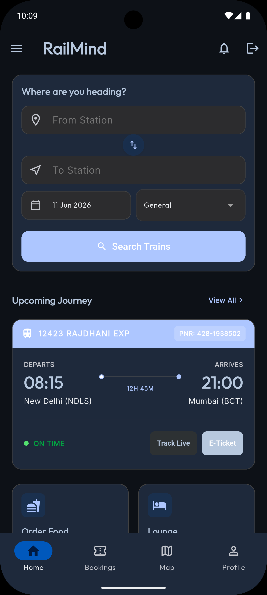
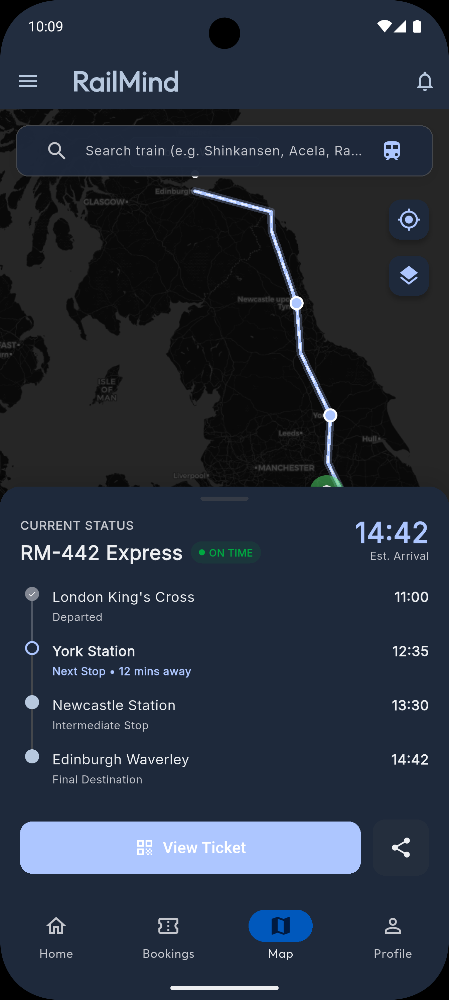
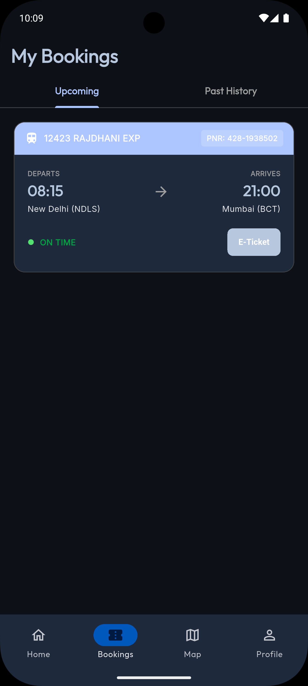

# 🚄 RailMind

<p align="center">
  <b>A premium, feature-rich Flutter application for seamless railway travel search, booking, and real-time live map tracking.</b>
</p>

---

## 📱 App Screenshots

| Home Screen | Live Tracking Map | My Bookings |
|:---:|:---:|:---:|
|  |  |  |

---

## 🎨 Redesign (Dark + Neon)

RailMind now ships with a premium **dark neon** design system: glassmorphic
cards, electric-cyan accents, soft glow shadows and an ambient gradient
background. A reusable UI kit (`lib/core/widgets/ui_kit.dart`) powers the look
across every screen.

## 🤖 New: RailMind AI & Smart Tools

- **RailMind AI assistant** (new **AI** tab): a conversational travel co-pilot.
  Connect an OpenAI-compatible key for GPT answers, or use the built-in offline
  "RailBot" that understands common railway intents — it always works.
- **PNR Status checker**: enter a PNR to see booking/coach/berth status. Uses a
  live rail API when configured, realistic generated data otherwise.
- **Fare Estimator**: per-class fare estimates for any distance & party size.

### 🔑 Optional API keys (everything works without them)

Provide keys at run/build time via `--dart-define`:

```bash
# AI assistant (OpenAI-compatible)
flutter run --dart-define=OPENAI_API_KEY=sk-... \
            --dart-define=OPENAI_MODEL=gpt-4o-mini

# Live PNR / train data (RapidAPI-compatible)
flutter run --dart-define=RAIL_API_KEY=... \
            --dart-define=RAIL_API_HOST=irctc1.p.rapidapi.com
```

When no key is present the app gracefully falls back to high-quality offline
data so the experience is never broken.

## ✨ Features

- **🌐 Interactive Live Map Tracking**: 
  - GPS-based real-time train tracking.
  - Interactive map engine utilizing `flutter_map` (OpenStreetMap / CartoDB Voyager styles).
  - Glowing, pulsing GPS train position marker.
  - Interactive station stop timelines with live statuses.
- **🔍 Smart Train Search**:
  - Search trains by origin, destination, date, and travel class (General, Sleeper, 3rd AC, 2nd AC).
  - Swappable station selector inputs.
  - Search history chips for quick re-searching.
- **🎫 Comprehensive Bookings Manager**:
  - Track upcoming and past train journeys.
  - High-fidelity ticket UI cards featuring PNR codes, timings, and live delays (e.g. ON TIME).
  - Quick action to view E-Tickets, invoices, or cancel bookings.
- **✨ Premium Passenger Services**:
  - Seat-delivered meal pre-ordering.
  - Executive lounge pre-booking access.
- **👤 Premium User Profile**:
  - Dynamic user avatar initials generator.
  - **Premium Voyager** loyalty tier badge.
  - Saved favorites and notification preferences.
- **🔒 Seamless Authentication**:
  - Integrated Sign Up / Sign In via Email & Password and Google Sign-In.
  - Automated routing and session redirection logic based on user authentication state.

---

## 🛠️ Tech Stack & Packages

- **Core Framework**: [Flutter & Dart](https://flutter.dev/)
- **State Management**: [Riverpod (flutter_riverpod)](https://riverpod.dev/) — robust reactive state binding, controllers, and providers.
- **Declarative Routing**: [GoRouter](https://pub.dev/packages/go_router) — clean path-based navigation with authentication redirects.
- **Backend & Database**: 
  - [Firebase Core](https://pub.dev/packages/firebase_core)
  - [Firebase Auth](https://pub.dev/packages/firebase_auth) & [Google Sign In](https://pub.dev/packages/google_sign_in)
  - [Cloud Firestore](https://pub.dev/packages/cloud_firestore)
  - [Firebase Messaging](https://pub.dev/packages/firebase_messaging) (Push Notifications)
- **Map & Geospatial Engines**: 
  - [flutter_map](https://pub.dev/packages/flutter_map) (open-source Leaflet mapping client)
  - [latlong2](https://pub.dev/packages/latlong2) (Geographical coordinates modeling)
- **Styling & Icons**: [Google Fonts (Outfit / Inter)](https://fonts.google.com/) & [Cupertino Icons](https://pub.dev/packages/cupertino_icons)
- **Caching**: [shared_preferences](https://pub.dev/packages/shared_preferences) for local search history persistence.

---

## 📁 Directory Structure

```text
lib/
├── core/
│   ├── routing/         # App router (GoRouter paths, redirect stream)
│   └── theme/           # Unified branding theme and color schemes
├── features/
│   ├── auth/            # Sign In / Sign Up, Providers, and presentation screens
│   ├── bookings/        # Ticket listing (Upcoming / Past), cancellations, and providers
│   ├── home/            # Station search, recent search history, service cards
│   ├── map/             # Map screen, custom pulsing markers, polyline layer, CartoDB/OSM layers
│   ├── navigation/      # Bottom navigation bar layout shell
│   ├── onboarding/      # Welcome/Intro walkthrough slides
│   ├── profile/         # Settings, voyager status, favorites, and profile configurations
│   └── splash/          # Launch animation and loader splash screen
├── models/              # Global models
└── services/            # Shared services (Auth, Firestore, Local storage)
```

---

## 🚀 Getting Started

To run this project locally, make sure you have the Flutter SDK installed and a target device connected.

### 1. Prerequisites
- [Flutter SDK](https://docs.flutter.dev/get-started/install) (v3.11.4 or higher recommended)
- [Dart SDK](https://dart.dev/get-started)
- [Firebase CLI](https://firebase.google.com/docs/cli) configured for project environment setup

### 2. Installation
Clone the repository, navigate to the directory, and download dependencies:
```bash
flutter pub get
```

### 3. Run the App
To start the app in debug mode on your connected emulator or physical device:
```bash
flutter run
```
